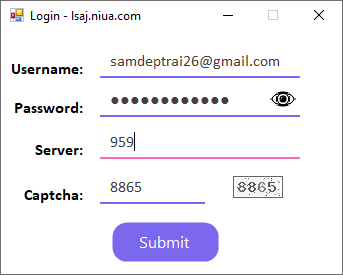
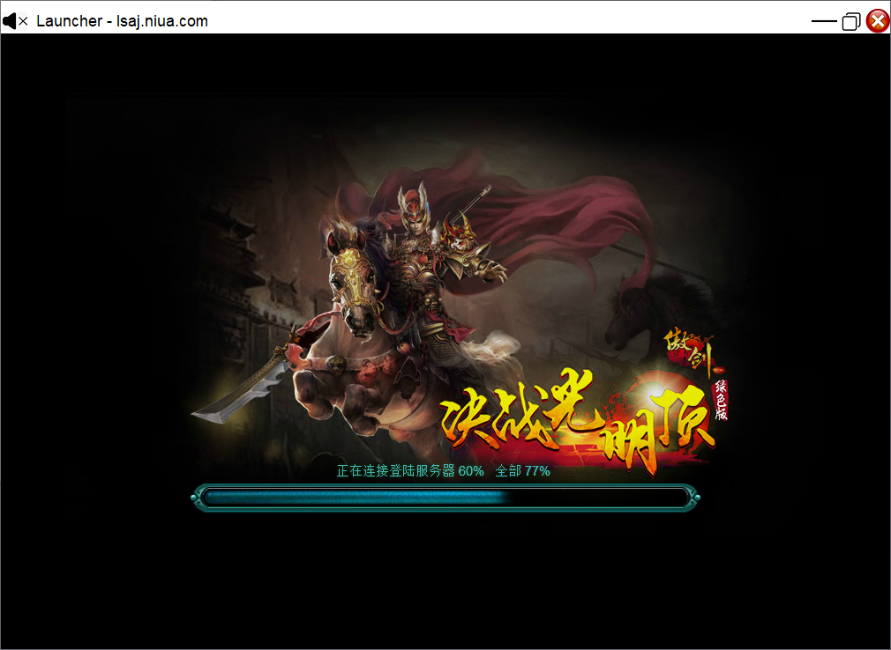

# Launcher for Game

## Purpose:
My childhood game requires multiple steps to login and load the game. Moreover, their website is very slow and would take ages to load. 

I created this application to login with a click of button and able to translate anything in the game with a click of a button instead of using Google Translate Image on my phone.

## Features
### **Login Window**
* Load login credentials from .env file (will change in the future)
* Solve Captcha Automatically (86% correct)
* Check for the newest server number to validate user input

### **Game Window**
* Custom TitleBar
* Mute/unmute application
* Check for the newest server number to validate user input
* Snipping Tool to capture an area on screen and ultilizes the Image Translator to translate it

### Stats
#### Image Translator
* ~0.9 seconds to recognize and extract the text from an image (depending on the size).
* ~0.2 seconds to bulk translate all of the text
* 200MB-4GB RAM usage depending on the image size and the number of text on image.

#### Captcha
* ~0.3 seconds to solve each captcha.
* 86% accuracy from 100 randomly chosen images

## Image Translator
For more information, check out https://github.com/pat266/Image-Translator. This repo shows different processes which showcase their results (accuracy), computation time, and memory usage
### Current process:
* EmguCV + pre-trained Onnx model
* Google Translate API (free) to translate it to English

### Some other failed text extraction processes
* Capture2Text (extracting text)
    * Inspired by https://github.com/phatjkk/DragonTranslator
    * http://capture2text.sourceforge.net/#text_line_capture
    * `./Capture2Text_CLI.exe -l "Chinese - Simplified" --trim-capture --line-breaks -i "testImg/sample.PNG" -o capture2text_result.txt`
    * The result is not very good. Many Chinese characters were not recognized.
* IronOCR-Chinese to detect the Chinese characters
    * Even though it is much better than Tesseract, it was still not able to detect the text on screen at a satisfactory level
    * It is also slow
* EmguCV alone (https://www.youtube.com/watch?v=KHes5M7zpGg)
    * Is worse than IronOCR
    * Does not work well to detect text in game. Works best when the background is clear.

## Images
* Gif of the current application:  

* Gif of the image translator:  

* Some sample images:
    * Loaded login screen:  
    

    * Loading game screen:  
    
